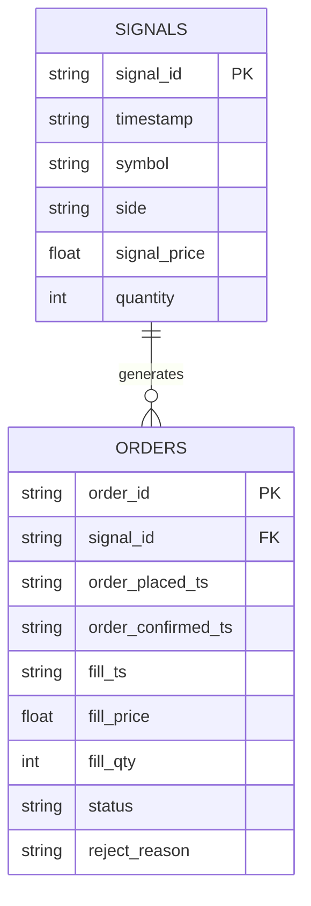
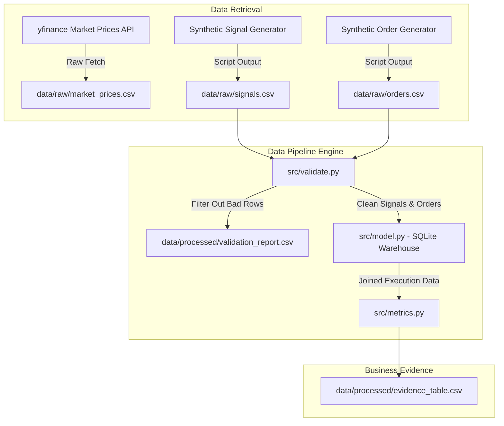

# Workflow & Entity Event Diagrams

## Entity Relationship Diagram (Mermaid)

```mermaid
erDiagram
    SIGNALS ||--o{ ORDERS : "generates"
    SIGNALS {
        string signal_id PK
        string timestamp
        string symbol
        string side
        float signal_price
        int quantity
    }
    ORDERS {
        string order_id PK
        string signal_id FK
        string order_placed_ts
        string order_confirmed_ts
        string fill_ts
        float fill_price
        int fill_qty
        string status
        string reject_reason
    }
```

## Data Pipeline Flow (Mermaid)

```mermaid
flowchart TD
    subgraph Data Retrieval
        A[yfinance Market Prices API] -->|Raw Fetch| RAW_MKT[data/raw/market_prices.csv]
        B[Synthetic Signal Generator] -->|Script Output| RAW_SIG[data/raw/signals.csv]
        C[Synthetic Order Generator] -->|Script Output| RAW_ORD[data/raw/orders.csv]
    end

    subgraph Data Pipeline Engine
        RAW_SIG & RAW_ORD --> VAL[src/validate.py]
        VAL -->|Filter Out Bad Rows| RPT[data/processed/validation_report.csv]
        VAL -->|Clean Signals & Orders| MODEL[src/model.py - SQLite Warehouse]
        MODEL -->|Joined Execution Data| METRICS[src/metrics.py]
    end

    subgraph Business Evidence
        METRICS --> TABLE[data/processed/evidence_table.csv]
    end
```
